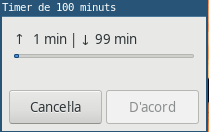

# Timer
Controlador del temps

L'arxiu `timer.sh` és un script escrit en bash per tal de portar un control del temps en **quatre sessions** seguides de **25 minuts**.

Es pot descansar una miqueta cada **25 minuts**, però no cal parar el compter, simplement saps que estàs dins d'un procés de treball de **100 minuts**.

Una senzilla finestreta anirà marcant el temps cada 5 minuts. Sols has de posar-la sempre a la vista i evitar les interupcions.

La consciència de no trencar la cadena cada 5 minuts et farà anar agafant l'hàbit.

Si volem cridar l'script des de la terminal o des del llançador d'escriptori caldrà posar l'script al directori `/usr/local/bin/`.

Després caldrà donar permisos d'execució:

``` bash
sudo chmod +x timer.sh
```

Fent-ho tot amb un comandament:

```bash
sudo wget -o /usr/local/bin/timer.sh https://raw.githubusercontent.com/inclusa/timer/master/timer.sh
```



Gaudiu del treball.
